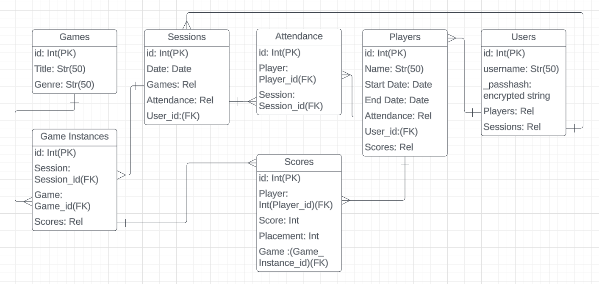

# Board Game Tracker

## Demo

https://www.youtube.com/watch?v=byQO8L-Foe4

## Project Pitch
  An online database to keep track of games, scores, and attendance at game nights, with a UI that displays any and all information that can be derived from the data (averages, placement, rankings, etc.). Users can log in and keep track of all the data they wish to and come back to it whenever they need.

---

## ERD



## File Structure

```console
.
├── CONTRIBUTING.md
├── LICENSE.md
├── Pipfile
├── Pipfile.lock
├── README.md
├── client
│   ├── README.md
│   ├── package.json
│   ├── public
│   └── src
└── server
    ├── app.py
    ├── config.py
    ├── instance
    ├── migrations
    ├── models.py
    └── seed.py
```

---

## User Stories

As a user:
 - I can login
 - I can create a new game session to track scores in
 - I can create players that will keep track of their attendance and scores at sessions
 - I can customize players at a session if someone can't make it
 - I can submit a game and scores to a session
 - I can look at the current overall placement of the players
 - I can change any previously submitted scores if there was a mistake

---

## Setup

### `server/`

To download the dependencies for the backend server, run:

```console
pipenv install
pipenv shell
```

Run the Flask API on [`localhost:5555`](http://localhost:5555) by
running:

```console
python server/app.py
```

### `client/`

To download the dependencies for the frontend client, run:

```console
npm install --prefix client
```

Run the React app on [`localhost:3000`](http://localhost:3000) by
running:

```sh
npm start --prefix client
```

---

## Resources

- [Setting up a repository - Atlassian](https://www.atlassian.com/git/tutorials/setting-up-a-repository)
- [Create a repo- GitHub Docs](https://docs.github.com/en/get-started/quickstart/create-a-repo)
- [Markdown Cheat Sheet](https://www.markdownguide.org/cheat-sheet/)
- [Python Circular Imports - StackAbuse](https://stackabuse.com/python-circular-imports/)
- [Flask-CORS](https://flask-cors.readthedocs.io/en/latest/)
